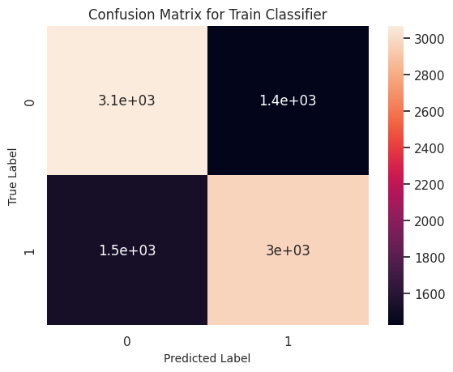

# Fake News Detection
Classification of fake news from the [LIAR Dataset](https://huggingface.co/datasets/liar). Uses transfer learning on language models: 'distilbert-base-cased', 'distilbert-base-uncased'.

## LIAR Dataset
This dataset is loaded from HuggingFace Datasets. This dataset is originally made for 6-class classification of fake news, providing a more nuanced classification of the 'truth' space. However, for a simple website interface, I thought it would be more intuititve to convert this dataset into a binary classification problem, by mapping relevant classes to 'Fake News' and 'Not Fake News' labels.
- For both finetuned models, class imbalance was addressed using random undersampling. This significantly improves performance, without this technique the model's learning stagnates and it quickly overfits the majority class.
- For the ***uncased*** model, I did some regex preprocessing along with stopword elimination for cleaning the text data. This is applied to all relevant columns, and the Jupyter Notebook is set to take any subset of the columns for training and evaluation.
- For the ***cased*** model, no preprocessing was applied to the text. The reasoning is that Fake News, like **clickbait** may contain relevant inconsistencies in writing style, capitalization and punctuation.

## Data Exploration
The data is all text-based. To better understand the data and distribution of key terms, I chose to view the top-k words with respect to the 6 provided labels:

### Top Word Count Distributions:

## Models
The finetuned DistilBERT models have been added to the HuggingFace Model database, and can be found in the following links:
- [FakeNewsClassifierDistilBert-cased](https://huggingface.co/caballeroch/FakeNewsClassifierDistilBert-cased)
- [FakeNewsClassifierDistilBert-uncased](https://huggingface.co/caballeroch/FakeNewsClassifierDistilBert-uncased)

These models can be accessed through the HuggingFace inference API. I use these references for input classification on a simple Flask server using python. 
- Future work will expand on the front-end and functionality of the site!

## Results
The model fits the data non-trivially, which is impressive given how complex is the task of Fake News Prediciton. For a simple implementation, this model would do pretty well in flagging misinformation. The uncased model achieve over 67% f1 on the train dataset, and over 63% f1 on the validation set (~13% boost over random selection). For reference, the model in the original LIAR Dataset paper achieves at most 27% accuracy on the holdout sets in the task of 6 class classification (which is ~10% accuracy boost over random selection). 

### Confusion Matrices:

  
  
  

### ROC Curves:

  
  
  

